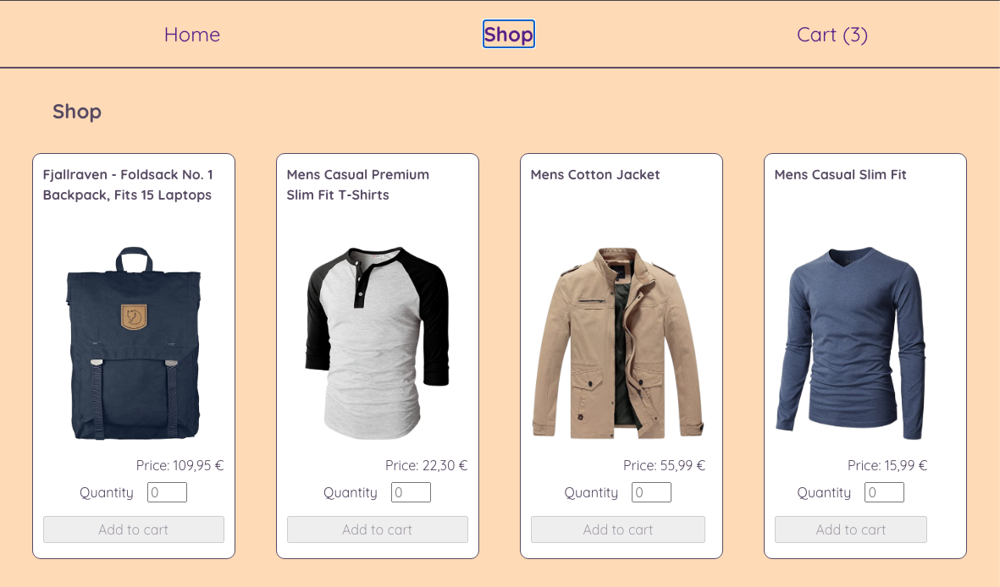

# Shopping Cart App

A mock e-commerce shopping cart built as part of [The Odin Project](https://www.theodinproject.com/lessons/node-path-react-new-shopping-cart). The app lets users browse products fetched from the [Fake Store API](https://fakestoreapi.com), add them to a cart, and manage quantities — all without an actual checkout/payment flow.

**Live demo:** []

## Features

- **Three pages** — Home, Shop, and Cart — connected through a shared navigation bar visible on every page.
- **Shop page** — each product is displayed as a card with an image, title, price, and a quantity form (manual input, with min/max constraints) to add it to the cart.
- **Cart badge** — the navbar link updates in real time to show the total number of items in the cart, without a full page reload.
- **Cart page** — lists every item currently in the cart with its quantity, unit price, and line total, plus an order total. Users can increase, decrease, or fully remove an item directly from the list.
- **Shared state via `Outlet` context** — product data and cart state (`itemsInCart`) live in the top-level `App` component and are distributed to every route through React Router's `<Outlet context={...}>`, so `Shop`, `Cart`, and their children read and update the same source of truth via `useOutletContext`.

## Tech stack

- React (Vite)
- React Router (data-loading via `useOutletContext`)
- Vitest + React Testing Library for testing
- Fake Store API for product data

## Testing approach

The app is tested with Vitest and React Testing Library.

## Possible improvements

- **Responsive / mobile styling**: the current styling only targets a desktop viewport; a mobile-first pass would be a natural next step.
- **Confirmation dialog before removing an item**: item removal is currently immediate; a confirmation step would reduce the risk of accidental removal.

## Credits

<a href="https://www.vecteezy.com/free-photos/clothes-store">Clothes Store Stock photos by Vecteezy</a>
